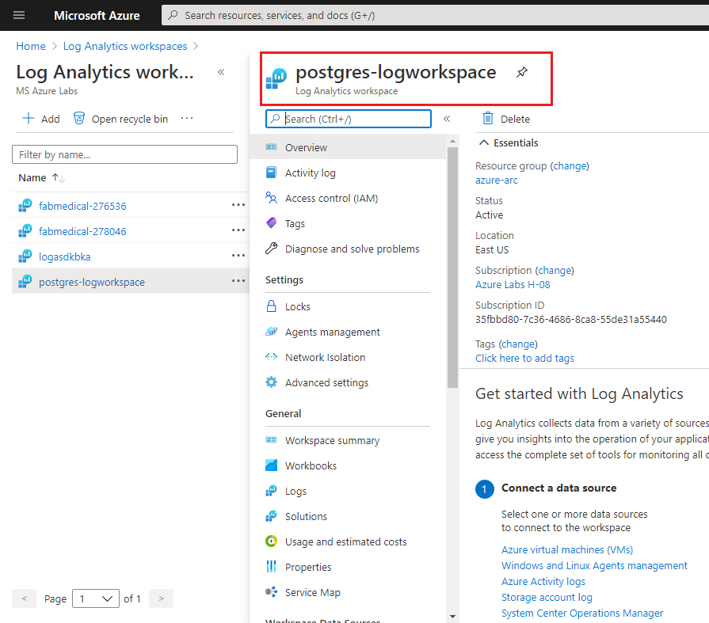
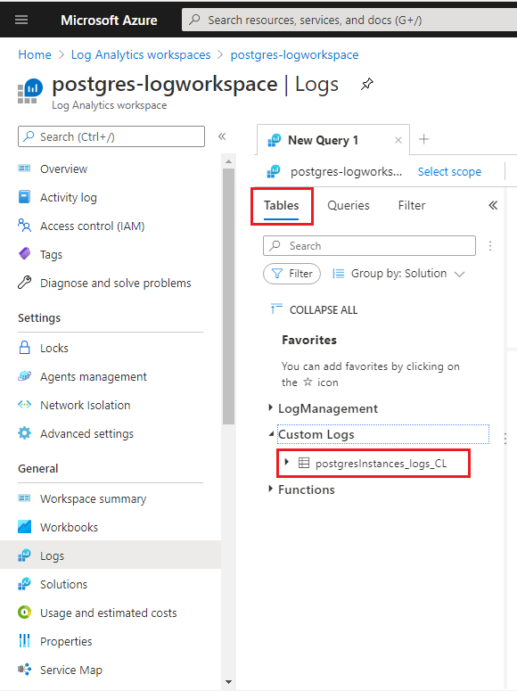
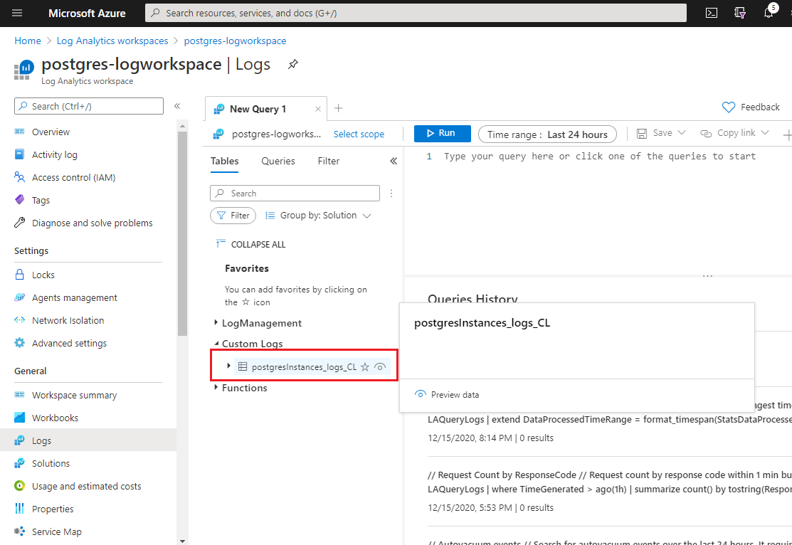

# Exercise 3: Azure Arc enabled PostgreSQL Hyperscale

Duration: -

In this exercise, you will perform the following:
 - create a Postgres Hyperscale Server group
 - configure & Scale, Connect on-premise source database, 
 - Backup & Restore on Postgres DB 
 - Monitor/Visualize with Grafana & Kibana Dashboards.

## Task 1: Create a Postgres Hyperscale Server group and connect to the Azure Arc enabled PostgreSQL Hyperscale server group.

In this task, you will learn how to create and connect Postgres Hyperscale Server group.

1. First click on **+ New Instance** in the Azure Arc Data Controller dashboard.

1. From the deployment options blade, select PostgreSQL Hyperscale server group - Azure Arc. 

1. In the next blade, Accept the Privacy and license terms and click **Next** at the bottom.

     

1. In the Deploy PostgreSQL Hyperscale server group - Azure Arc blade, enter the following information:

   **Under General settings**
   
   - **Server group name**: Enter arcpostgres 
   
   - **Password**: Enter Password.1!!
   
   - **Number of workers**: Enter 2
   
   - **Port**: Leave it default
    
     
   
   **Under Resource settings**
  
   - **CPU request**: Enter 2
   
   - **CPU limit**: Enter 2.5
   
   - **Memory request**: Enter 2.5
   
   - **Memory limit**: Enter 2.5
   
     
   
1. Click on the **Deploy** button. This initiates the creation of the Azure Arc enabled PostgreSQL Hyperscale server group on the Arc enabled data services environment.

   
   
1. Now a **deploy.postgres.existing.arc** page will open up in the Azure Data Studio.

   

1. Scroll down to the bottom of the page and you will see that the PostgreSQL Hyperscale - Azure Arc instance creation has been started.

   

1. The deployment will take around 5 to 10 minutes and once successful, you can see the output "arcpostgres is Ready"

   

1. Once the deployment is complete, in **Azure Arc Data Controller dashboard** page in the Azure Data Studio, click on Refresh. 

1. The, under Azure Arc Resources, you will be able to see the recently created Postgres Hyperscale Server group.

   


**Connect on-premise source database and Azure Arc enabled PostgreSQL server**

1. In the command prompt window, run the following to get the Postgres servers list in AKS using the Azure Arc data controller. 
   
   ```BASH
   azdata arc postgres server list
   ```
  
   ```BASH
   Name        State    Workers
   ----------  -------  ---------
   postgres01  Ready    2

   ```

1. Run the following command to get connection string details for postgres01 server endpoint .

   ```BASH
   azdata arc postgres endpoint list -n arcpostgres
   ```
   

1. On your LabVM, open the PgAdmin tool from the start menu to connect Azure arc enabled Postgres Hyperscale database 

      

   > Note: If you get any prompts to unlock master password, please provide "Password.1!!", select Save Password and then click on OK.

1. Now, right click on the Servers and click on Create. Then click on Server.

   
   
1. Now provide the following details:

   - Name: postgres01
   
   

1. Now, select the connection tab and enter the connection string details similar by referring to the one retrieved in the previous azdata command.

    ```BASH
   PostgreSQL Instance   postgresql://postgres:<replace with password>@40.121.8.176:5432
   ```

   - Host name/address: IP Address
   - Port: 5432
   - Username: postgres
   - Password: Password.1!!
   - Select Save Password

   

1. After you click on Save, you will be connected to the server.

   

## Task 2: How to migrate from different on-premises/cloud server?

In this task you will migrate an on-premise PostgreSQL database to Azure Arc enabled PostgreSQL Hyperscale server group.

### Backup from Source Server:

You will take backup of the Postgres Server running on-premises on a bare metal server named **PostgreLocal**. It contains a database named **Arc-Demo-PG** that has 4 tables.

#### Take a backup of the source database in on-premises

1. Now, you will click on arrow icon next to postgreLocal Server and expand

   

   
   
1. Then right click on the Arc-Demo-PG and select **Backup..** option

   

1. The provide the following details: 

      - Filename: **C:\Users\arcdemo\Arc-Demo-Bkp**
      - Format: **Custom**

   

1. You can keep rest of the values as default and then click on **Backup**.

1. Now, the backup job will get started and will get completed successfully in a few seconds.

   
   
1. Close the backup prompt by clicking on the x in the prompt.

### Restore to Destination Server:

You will restore the sample database **Arc-Demo-Bkp** from source server **PostgresLocal** on to the Postgres server **postgres01** running on an Azure Arc environment with new Database named **Restored_Arc-Demo-Bkp**. 

First, you will create an empty database on the destination system in your Azure Arc enabled PostgreSQL Hyperscale server group

1. Right click on the postgres01 server on the pgAdmin and then Select Create -> Database option from postgres01 database menu

   

1. In the blade that comes up, provide the Database name as **Restored_Arc-Demo-PG** and then click on Save button at the bottom of the blade.

   

Now, you will restore the database in to your Arc enabled data services environment:


1. Expand the postres01 server by clicking on " > " icon next to postgres01.

1. Right click on the **Restored_Arc-Demo-PG** database and then click on **Restore** option.

1. In the restore blade that comes up, provide the following path for the Filename: **C:\Users\arcdemo\Arc-Demo-Bkp**

   

1. Keep the default values for the rest of the options and then click on **Restore**.
   
   
   
1. Now, a restore job will be created which will take around 1 second to complete successfully. 
      
   
   
1. Once the restoration is successful, you can close the prompt by clicking on x icon at the top right of the prompt.

### Verify that the database was successfully restored in your Azure Arc enabled PostgreSQL Hyperscale server group

We will verify if the database has been restored from Database running on local server to the the Arc enabled PostgreSQL Server by querying the data in both databases.

1. For that, you will use PgAdmin in which you are already connected to both Postgres instances ( local and Arc ).

1. First, you will connect to the database **Arc-Demo-PG** and query the row count in table pgbench_accounts:

1. Right-click on the database **Arc-Demo-PG**  and select Query tool to open a new query window 

1. Copy and paste the below query in the Query Editor 

   ```BASH
   select count(*) from Public.pgbench_accounts;
   ```
   
1. Click on > icon on the top right to run the query to see the no of rows of **pgbench_accounts** table 

   
   
    > You'll see that the no of rows of data is 10000.
    
1. Now, you will connect to the database **Restored_Arc-Demo-PG** and query the row count in table pgbench_accounts:

1. Right-click on the database **Restored_Arc-Demo-PG**  and select Query tool to open a new query window 

1. Copy and paste the below query in the Query Editor 

   ```BASH
   select count(*) from Public.pgbench_accounts;
   ```
   
1. Click on > icon on the top right to run the query to see the no of rows of **pgbench_accounts** table 

   
   
The database migration was successful if the row counts are same in both **Arc-Demo-PG** and **Restored_Arc-Demo-PG** Databases.

## Task 3: Backup/Restore and Review the distribution of data 

In this task you will see how to backup the database in Arc enabled PostgreSQL Servers and restore it.

1. To get started, you will open the Command Prompt window.

1. Now, you will verify if the Hyperscale server group has been configured to use backup storage class.

1. Then, run following command to view details of existing PostgreSQL Hyperscale server

   ```BASH
   azdata arc postgres server show -n arcpostgres
   ```
   Look at the storage section of the output:
   
   
   
### Take a manual full backup


1. Run following command to take a full backup of the entire data and log folders of Postgres server group by :
   ```BASH
   azdata arc postgres backup create --name backup01 --server-name arcpostgres
   ```
   This command will coordinate a distributed full backup across all the nodes that constitute Azure Arc enabled PostgreSQL Hyperscale server group.

   Where:
   - **name** indicates the name of a backup
   - **server-name** indicates a server group

   When the backup completes, the ID, name, size, state, and timestamp of the backup will be returned.
   ```BASH
   {
   "ID": "7212353a05ee45dca542da2add498270",
   "name": "backup01",
   "size": "21.11 MiB",
   "state": "Done",
   "timestamp": "2020-12-14 10:39:27+00:00"
   }
   ```

   

   In the above result, "+00:00" means UTC time (UTC + 00 hour 00 minutes)

### List backups

1. To list the backups that are available to restore.
   ```BASH
   azdata arc postgres backup list --server-name arcpostgres
   ```
   Returns an output like:
   ```BASH
   ID                                Name                   Size       State    Timestamp
   --------------------------------  ---------------------  ---------  -------  -------------------------
   7212353a05ee45dca542da2add498270  backup14122020-0408pm  21.11 MiB  Done     2020-12-14 10:39:27+00:00
   ```

   

### Restore a full backup

1. You will restore the entire content of a backup.
   
#### Restoring the server group postgres onto itself:

   Run following command to restore **postgres** DB onto itself
   ```BASH
   azdata arc postgres backup restore -sn arcpostgres --backup-id 7212353a05ee45dca542da2add498270
   ```
   
   This operation is only supported for PostgreSQL version 12 and higher.

### Rivewing Distribution of data 

1. In distributed table by default create_distributed_table() makes 32 shards, as you can see by counting in the metadata table **pg_dist_shard**

   Run following query to check the count in the metadata table **pg_dist_shard**
   ```BASH
   select logicalrelid, count(shardid) from pg_dist_shard group by logicalrelid;
   ```

   ```BASH
    logicalrelid | count
   --------------+-------
    users        |    32
   ```
   

1. Run the following query to find the average age of users which gets data from distributed table **users**. 

   ```BASH
   select avg(current_date - bday) as avg_days_old from users;
   ```

   You have executed the above query by treating the distributed **users** table like it's a normal table

   ```BASH
      avg_days_old
   --------------------
   3454.914000000000
   ```

      

   The output shows an example of a Distribution (sharding) of data across worker nodes.


## Task 4: Configure & Scale, and review the distribution of data.

In this task you will see how to Configure & Scale, and review the distribution of data on the Database.

1. On your LabVM launch a **Command Prompt** window (Select search on the taskbar, type cmd, and select Enter).

1. Run the following query to verify that you currently have three Hyperscale worker nodes, each corresponding to a Kubernetes pod.

   ```BASH
   azdata arc postgres server list
   ```

   ```BASH
   Name         State    Workers
   -----------  -------  ---------
   arcpostgres  Ready    2
   ```
   
1. Now to scale-out **Azure Arc enabled PostgreSQL Hyperscale**,  in the command prompt run the following command. This will increase the number of worker nodes from 3 to 5.

   ```BASH
   azdata arc postgres server edit -n arcpostgres -w 4
   ```
  
   > **Note**: Wait for the command to complete 
  
1. Run the following command and verify that the server group is now using the additional worker nodes you added. In the output, you should be able to see 5 worker nodes.
   
   ```BASH
   azdata arc postgres server list
   ```

   ```BASH
   Name         State    Workers
   -----------  -------  ---------
   arcpostgres  Ready    3
   ```

1. Once the nodes are available, the Hyperscale Shard Rebalancer runs automatically and redistributes the data to the new nodes. The scale-out operation is an online operation. While the nodes are added and the data is redistributed across the nodes, the data remains available for queries.

1. You can also scale up, from **PostgreSQL Hyperscale - Azure Arc Dashboard**. 

### Rivewing Distribution of data 

1. In distributed table by default create_distributed_table() makes 32 shards, as you can see by counting in the metadata table **pg_dist_shard**

   Run following query to check the count in the metadata table **pg_dist_shard**
   ```BASH
   select logicalrelid, count(shardid) from pg_dist_shard group by logicalrelid;
   ```

   ```BASH
    logicalrelid | count
   --------------+-------
    users        |    32
   ```
   

1. Run the following query to find the average age of users which gets data from distributed table **users**. 

   ```BASH
   select avg(current_date - bday) as avg_days_old from users;
   ```

   You have executed the above query by treating the distributed **users** table like it's a normal table

   ```BASH
      avg_days_old
   --------------------
   3454.914000000000
   ```

      

   The output shows an example of a Distribution (sharding) of data across worker nodes.

## Task 5: Monitor/Visualize with Dashboards

Now that you are connected to a data controller, you can view the dashboards for the data controller and any SQL managed instances or PostgreSQL Hyperscale server group resources that you have.

1. In the **Connections** panel, under **Arc Controllers** right-click on the  arcdc data controller and select **Manage**.

   

1. In the Azure Arc Data Controller dashboard, you can see Grafana and Kibana Dashboard URLs along with details about the data controller resource.

   

   Kibana and Grafana web dashboards are provided to bring insight and clarity to the Kubernetes namespaces being used by Azure Arc enabled data services. 

1. Open Azure Data studio on Jumpbox and right click on the Postgres server reosurce under Azure Arc controller and click on manage.
  
  1. Now copy the endpoint for Kibana dashboard and browser this endpoint in a browser.
  
  1. Enter below user name and password for Postgres DB.
  
   > **Note** You have to enter the credentials of Azure Arc data controller.

   
  
  
   - **User name** : arcuser
   - **Password** : Password.1!!
   
   
  
    > You can learn more about kibana here : https://docs.microsoft.com/en-us/azure/azure-arc/data/monitor-grafana-kibana
    
 
### View the Visualization and metric using grafana graph
  
1. Open Azure Data studio on Jumpbox and right click on the Postgres server reosurce under Azure Arc controller and click on manage.
  
1. Now copy the endpoint for Grafana dashboard and browser this endpoint in a browser.
  
1. Enter below user name and password for Postgres DB.
  
   - **Note** You have to enter the credentials of Azure Arc data controller.

   
  
      - **User name** : arcuser
   
      - **Password** : Password.1!!

   
   
1. You can explore the page for Grafana. 
  
    > You can learn more about Grafana here : https://docs.microsoft.com/en-us/azure/azure-arc/data/monitor-grafana-kibana


## Task 6: Create Log anaytics workspace to upload logs, metric and usages to Azure Monitor. 

In this task you will create a log analytics workspace to upload logs for your Azure Arc enabled SQL managed instances and Azure Arc enabled PostgreSQL Hyperscale server groups to Azure Monitor and view your logs in Azure portal

1. In the command prompt run the following command to login to azure. On the sign-in page enter the username and password, you can find the username and password from the environment details tab.

   ```BASH
   az login
   ```

   

1. In the command prompt run the following command to create a log analytics workspace. 

    >**Note**: Please make sure to replace the resource group name and workspace name. You can find resource group name from the environment details tab and for workspace name enter a globally unique value.

   ```BASH
   az monitor log-analytics workspace create --resource-group <resource group name> --workspace-name <Unique name of workspace>
   ```

   

   
1. From the output window copy the **customerID** value and save the value locally in the text file, you will use these values in the later part of the lab.

1. Now run the following command to retrieve the access keys required to connect to your log analytics workspace. Make sure to replace resource group name and workspace name

   ```BASH
     az monitor log-analytics workspace get-shared-keys --resource-group MyResourceGroup --workspace-name <Unique name of workspace>
   ```

   
   
1. From the output window copy the **"primarySharedKey** value and save the value locally in the text file, you will use these values in the later part of the lab.

1. In the command prompt, replace the **customerId**, **primarySharedKey** in the following command with the values which you copied earlier and run it. This command saves the customerId and primarySharedKey values in an environment variable to use later in the lab.

   ```BASH
   SET WORKSPACE_ID=<customerId>
   SET WORKSPACE_SHARED_KEY=<primarySharedKey>
   ```

   

1. Run the following command to set the SPN authority URL in an environment variable.

   ```BASH
   SET SPN_AUTHORITY=https://login.microsoftonline.com
   ```

   

1. Now run the following command to make sure that all environment variables required are set.

   ```BASH
   echo %WORKSPACE_ID%
   echo %WORKSPACE_SHARED_KEY%
   echo %SPN_TENANT_ID%
   echo %SPN_CLIENT_ID%
   echo %SPN_CLIENT_SECRET%
   echo %SPN_AUTHORITY%
   ```
   > **Note**: You have already added the variables of Service principal details, So you dont have to add these variables value.
   

1. In the command prompt run the following to log in to the Azure Arc data controller. Follow the prompts to set the namespace, the administrator username, and the password.

   ```BASH
   azdata login
   ```

   

1. Export all logs to the specified file:

   ```BASH
   azdata arc dc export --type logs --path logs.json
   ```
   
1. Upload logs to an Azure monitor log analytics workspace:

   ```BASH
   azdata arc dc upload --path logs.json
   ```
   
   

1. Now to view your logs in the Azure portal, open the Azure portal and then search for your log analytics workspace by name in the search bar at the top and then select it.

1. In the **Log Analytics workspaces** page, select your workspace.

   

1. Now in your log analytics workspace page, from the left navigation menu under **General** select **Logs** and click on **Get Started**.

   

1. In the logs page, expand Custom Logs at the bottom of the list of tables and you will see a table called **postgresInstances_logs_CL**.

   

1. Select the **eye** icon next to the table name and select the **View in query editor** button.

   

1. Now you will have a query in the query editor that will show the most recent 10 events in the log.

   

1. In the query editor click on **Run** to display the results.

   

   > **Note**  Now you have created the **Log Analytics workspaces** but you can't upload any usages or logs. You will be uploading the Logs and usages in Next exercises.  
   
## After this exercise, you have learned the following,
   - create a Postgres Hyperscale Server group.
   - Backup/Restore and Review the distribution of data.
   - How to migrate from different on-premises/cloud server.
   - Distribution(Shard) of data on worker nodes.
   - Configure & Scale, and review the distribution of data.
   - Monitor/Visualize with Azure Data Studio Dashboards.
   - Upload usage data, metrics, and logs to Azure Monitor.
