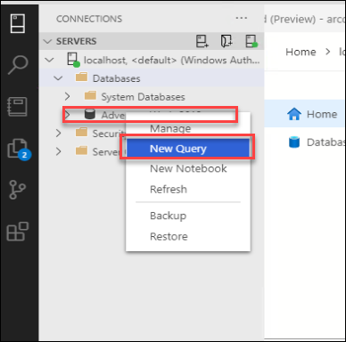

# Exercise 4: Azure Arc enabled SQL Managed Instance

Duration: - 30 mins

In this exercise, let's create an **Azure SQL managed instance - Azure Arc** and restore and migrate the database using multiple methods. 

Also, we will be exploring the Kibana and Grafana Dashboards and upload the logs and metrics to the Azure portal and view the logs.

## Task 1: Create Azure Arc enabled SQL Managed Instance 

In this task, let's learn how to create Azure Arc enabled SQL Managed Instance using Azure Arc Data controller.

1. Open **Azure data studio** from the desktop if not already opened. 

1. Now right click on the Azure Arc data controller connection, click on Manage, and then click on the **New Instance** button from the Azure Arc Data controller dashboard. 

   
  
1. Now select the **Azure SQL Managed Instance- Azure Arc (preview)** and click on **Select**.

   
   
1. Now select the **Checkbox** to accept the Microsoft Privacy statement and click on **Next button**. You can click on the privacy statement link to view the terms and conditions.

   > **Note**: You will also see some **Required tools** under the terms and conditions line, these tools are required to deploy the Azure Arc enabled SQL Managed Instance. You don't have to worry about this because we have already installed these tools.

   

1. In the deploy **Azure SQL managed instance - Azure Arc blade**, enter the following information:

   **Under SQL Connection information**
   
   - **Instance name**: Enter arcsql
     ```BASH
     arcsql
     ```
   
   - **Username**:  Enter arcsqluser
     ```BASH
     arcsqluser
     ```
   
   - **Password**: Enter Password.1!!
     ```BASH
     Password.1!!
     ```
   
   **SQL Instance settings**
  
   - **Core Request**: Enter 1
     ```BASH
     1
     ```
   
   - **Core Limit**: Enter 2
     ```BASH
     2
     ```
   
   - **Memory Request**: Enter 2
     ```BASH
     2
     ```
   
   - **Memory Limit**: Enter 2
     ```BASH
     2
     ```
   
1. Click the **Deploy** button, this will start the deployment of the  **Azure SQL managed instance - Azure Arc** on the data controller.

   
     
1. After clicking on the deployment button, a Notebook will open and automatically execute the cells to deploy the **SQLMI Instance**.

   

1. The deployment of **Azure SQL managed instance - Azure Arc** will take about 10 minutes to complete, in this time you can explore through the commands in the notebook.

1. After sometime you will see that **arcsql is Ready** in output windows. 

   

1. Once the installation is complete, in **Azure Arc Data Controller dashboard** under Azure Arc Resources you can see the newly created Azure Arc enabled SQL Managed Instance.

   

   > Note: You might have to right-click and refresh on Arc data controller to view the instance.

## Task 2: Connect to Azure Arc enabled SQL Managed Instance Using Azure data studio.

In this task, let us learn how to connect to your newly created Azure Arc enabled SQL Managed Instance using Data Studio.

1. In the **Azure Arc Data Controller dashboard**, under Azure Arc Resources right-click on your newly created SQL Managed Instance and select manage, this will open  **SQL managed instance - Azure Arc Data Controller dashboard**.

1. Now in the **SQL managed instance - Azure Arc Data Controller dashboard**, copy the **IP Address** from under external endpoint. You can also see that the status is **Ready**.

   

1. In the Data studio page, in connections blade under servers click on **New Connection**.

   

1. Enter the following in the connection details page and click on **Connect**.

   - **Connection type** : Select **Microsoft SQL Server**.
   
   - **Sever**: Paste the external endpoint value which you copied earlier

   >**Note**: Make sure you have entered **IP Address** only and remove **port number**.
   
   - **Authentication type** : Select **SQL Login** from the drop down options
   
   - **User name** : Enter arcsqluser
     ```BASH
     arcsqluser
     ```
   
   - **Password** : Enter Password.1!!
     ```BASH
     Password.1!!
     ```
   
   
   
1. Now you can see that you are successfully connected with your Azure Arc enabled SQL MI Server. Under servers you can see that you are successfully connected with your Azure Arc enabled SQL MI Server. You can explore the SQLMI dashboard to view the databases and run a query.

   

## Task 3: Configure Azure Arc enabled SQL Managed Instance

In this task, let's learn to edit the configuration of Azure Arc enabled SQL Managed Instances with Azure Data CLI.

1. Open Command Prompt from the desktop shortcut and run the following command to see configuration options of SQL Managed Instance.

   ```BASH
   azdata arc sql mi edit --help
   ```
   
1. Now run the following command to set the custom CPU core and memory requests and limit. 

   >**Note**: Make sure to replace with your SQL Managed Instance name. Also don’t select the Core and memory limit more than the given limits.

   ```BASH
   azdata arc sql mi edit --cores-limit 3 --cores-request 2 --memory-limit 2Gi --memory-request 2Gi -n <NAME_OF_SQL_MI>
   ```      

1. Now run the below command to view the changes that you made to the SQL Managed Instance.

   >**Note**: Make sure to replace with your SQL Managed Instance name.
   
   ```BASH
   azdata arc sql mi show -n <NAME_OF_SQL_MI>
   ```

## Task 4: Restore the AdventureWorks sample database into SQL Managed Instance - Azure Arc Using Kubectl.

Now let's restore the sample backup file i.e AdventureWorks backup (.bak) into your SQL Managed Instance container using Kubectl commands.

1. Launch a **Command Prompt** window from the desktop of your JumpVM.

1. In the Command Prompt, run the following command to get the list of pods that are running on your data controller. Copy the pod name of the SQL MI instance from the output.

   > **Note**: Please make sure to replace the namespace name with your data controller namespace name.

   ```BASH
    kubectl get pods -n <your namespace name>
   ```
   
1. In the Command Prompt, run the following command. This will remotely execute a command inside of the SQL Managed Instance container to download the .bak file into the container.

   >**Note**: Replace the value of the namespace name and pod name with the value you copied in the previous step.

   ```BASH
   kubectl exec <SQL pod name> -n <your namespace name> -c arc-sqlmi -- wget https://github.com/Microsoft/sql-server-samples/releases/download/adventureworks/AdventureWorks2019.bak -O /var/opt/mssql/data/AdventureWorks2019.bak
   ```

1. Now to restore the AdventureWorks database, run the following command.

   > **Note**: Ensure to replace the value of the pod name, namespace name, and the password before you run it.

   ```BASH
   kubectl exec <SQL pod name> -n <your namespace name> -c arc-sqlmi -- /opt/mssql-tools/bin/sqlcmd -S localhost -U arcsqluser -P <password> -Q "RESTORE DATABASE AdventureWorks2019 FROM  DISK = N'/var/opt/mssql/data/AdventureWorks2019.bak' WITH MOVE 'AdventureWorks2017' TO '/var/opt/mssql/data/AdventureWorks2019.mdf', MOVE 'AdventureWorks2017_Log' TO '/var/opt/mssql/data/AdventureWorks2019_Log.ldf'"
   ```

1. Now switch back to Azure Data Studio, right-click on the SQL MI Server and click on refresh, then expand your SQL MI server, expand Databases and verify that AdventureWorks2019 DB is listed.

## Task 5: Migrate: Migrate and Restore SQL Server DB to Azure Arc enabled SQL Managed Instance from Blob storage and Azure arc pod.

Now that we have the Azure SQL Managed Instance ready, let's migrate and restore the SQL server database to the Azure arc enabled SQLMI. 
   
There are two methods to do the migration and restore - one is by using the Azure blob storage to back up and restore DB to SQLMI and the second one is by using the Kubectl commands. 

 **Method 1: Using Azure blob storage** 
 
 **Step 1: Migrate: SQL Server to Azure Arc enabled SQL Managed Instance**

1. Log into Azure Portal and go to your lab environment RG, you will be able to find Azure blob storage name as acrblobstorageSUFFIX, open that and click on the Access keys from the left side bar. Now click on the Show keys button to get the keys.

   

2. Now you will be able to see the storage account name and storage account keys. Copy the storage account name and key1 from the portal and save it in a **notepad** for later usage.

3. Launch Azure data studio and click on the **localhost** to connect with the local server. After connecting Expand the databases folder and right-click on **AdventureWorks2019** Database, and select **New Query**.

   

4. Prepare your query in the following format replacing the placeholders indicated by the <...> using the information from the Storage account name and access key in earlier steps. 

   Once you have substituted the values, run the query. 

   ```BASH
   IF NOT EXISTS  
   (SELECT * FROM sys.credentials
   WHERE name = 'storagecred')  
   CREATE CREDENTIAL [storagecred]
   WITH IDENTITY = '<Storage Account Name>',  
   SECRET = '<Access key1>';
   ```

   Once you see that the Command is executed successfully go to the next step.
          
   

5. Similarly, prepare the BACKUP DATABASE command as follows to create a backup file to the blob container. 

   Once you have substituted the values, run the query. Make sure you replace the values of **Database name**, **Storage account name**, **Container name**, and **Filename**.

    ``` 
    BACKUP DATABASE <database name> TO URL = 'https://<mystorageaccountname>.blob.core.windows.net/<mystorageaccountcontainername>/<filename>.bak'
    WITH credential = 'storagecred'; 
    ```

   Once you see that the Command is executed successfully go to the next step.

   
   
6. Open the Azure portal and validate that the backup file created in the previous step is visible in the Blob container. For this, you have to go to the storage account and click on the container button and then open the arccontainer to view the backup file.
  
   

**Step 2: Restore the database from Azure blob storage to SQL Managed Instance - Azure Arc**

1. From Azure Data Studio, login and connect to the SQL Managed Instance - Azure Arc.

1. Expand the System Databases, right-click on the master database, and select New Query.

1. In the query editor window, prepare and run the same query from the previous step to create the credentials.

   ```
   IF NOT EXISTS  
   (SELECT * FROM sys.credentials
   WHERE name = 'storagecred')  
   CREATE CREDENTIAL [storagecred]
   WITH IDENTITY = '<Storage Account Name>',  
   SECRET = '<Access key1>';
   ```
 
1. Prepare and run the below command to verify the backup file is readable and intact. Make a note of logical names from the output windows.

   ```
   RESTORE FILELISTONLY FROM URL = 'https://<Sttorage account name>.blob.core.windows.net/<Container name>/<File Name>.bak'
   WITH credential = 'storagecred';
   ```

1. Prepare and run the RESTORE DATABASE command as follows to restore the backup file to a database on SQL Managed Instance - Azure Arc. Make sure you update the test and test_log value to the logical values from the previous step.    

   ```
   RESTORE DATABASE <database name> FROM URL = 'https://<mystorageaccountname>.blob.core.windows.net/<mystorageaccountcontainername>/<file name>'
   WITH MOVE 'Test' to '/var/opt/mssql/data/<file name>.mdf'
   ,MOVE 'Test_log' to '/var/opt/mssql/data/<file name>.ldf'
   ,RECOVERY  
   ,REPLACE  
   ,STATS = 5;  
   GO
   ```
    
**Method 2: Copy the backup file into an Azure SQL Managed Instance - Azure Arc pod using kubectl**
   
This method shows you how to take a backup file that you create via any method and then copy it into local storage in the Azure SQL managed instance pod.
   
So you can restore from there much like you would on a typical file system on Windows or Linux.
   
In this scenario, you will be using the command kubectl cp to copy the file from one place into the pod's file system.
   
1. Connect to the SQL MI using azure data studio and right-click on the database and click on the new query and paste the below query.
   
   ```
   BACKUP DATABASE AdventureWorks2019
   TO DISK = 'c:\tmp\<DB name>.bak'
   WITH FORMAT, MEDIANAME = 'AdventureWorks2019’ ;
   GO
   ```
    
2. Open CMD and run the below command to get the SQLMI pod name.
   
   ```
   kubectl get pods -n <namespace of data controller>
   ```

3. Copy the backup file from the local storage to the SQL pod in the cluster using the below SQL query. Make sure you replace the SQLMI pod name and DB name.
   
   ```
   kubectl cp C:\temp\<DB name>.bak <SQLMI pod name>:var/opt/mssql/data/<DB Name>.bak -n arc
   ```

4. Run the below query to restore the database to the SQL Managed instance - Azure arc
     
   ```
   RESTORE DATABASE test FROM DISK = '/var/opt/mssql/data/<file name>.bak'
   WITH MOVE '<database name>' to '/var/opt/mssql/data/<file name>.mdf'  
   ,MOVE '<database name>' to '/var/opt/mssql/data/<file name>_log.ldf'  
   ,RECOVERY  
   ,REPLACE  
   ,STATS = 5;  
   GO
   ```

5. Now you can see that the database is created.
   
## Task 6: View SQL MI resource and SQL Mi logs in Azure Portal.
   
Now that we have the database created, let us upload some metrics, usages, and logs to the azure portal and view SQLMI Resource in the Azure portal.
   
1. Open CMD from the desktop shortcut on your VM and login to the Azure Arc Data controller using the below command.
   
   ```
   azdata login
   ```

1. Run these below commands to check if the variables is set or not.
   
   ```BASH
   echo %WORKSPACE_ID%
   ```

   ```BASH
   echo %WORKSPACE_SHARED_KEY%
   ```

   ```BASH
   echo %SPN_TENANT_ID%
   ```

   ```BASH
   echo %SPN_CLIENT_ID%
   ```

   ```BASH
   echo %SPN_CLIENT_SECRET%
   ```

   ```BASH
   echo %SPN_AUTHORITY%
   ```
       
1. If the variables are not defined, set it now using the below commands.
   
   ```
   SET WORKSPACE_ID=<customerId>
   ```

   ```
   SET WORKSPACE_SHARED_KEY=<primarySharedKey>
   ```

   ```
   SET SPN_CLIENT_ID=<appId>
   ```

   ```   
   SET SPN_CLIENT_SECRET=<password>
   ```

   ```
   SET SPN_TENANT_ID=<tenant>
   ```

   ```
   SET SPN_AUTHORITY=https://login.microsoftonline.com
   ```

   > **Note**: You can get the workspace ID and key from the azure portal and service principal details from the lab environment page.

1. Export all logs to the specified file:
   
   ```
   azdata arc dc export --type logs --path logs.json
   ```

1. Upload logs to an Azure monitor log analytics workspace:
      
   > **Note**: We have already deployed the log analytics workspace in the previous exercise.
   
   ```
   azdata arc dc upload --path logs.json
   ```
      
1. After some time, you will see some outputs uploaded to Azure.

   
    
1. Now open the azure portal and search for **SQL Managed instances - azure arc**  and select the resource.

   
      
1. Now you will see some basic information about the Azure Arc enabled SQL MI.
      
   
   
1. Now to view your logs in the Azure portal, open the Azure portal and then search for your log analytics workspace by name in the search bar at the top and then select it.

1. In the **Log Analytics workspaces** page, select your workspace.
   
   

1. Now in your log analytics workspace page, from the left navigation menu under **General** select **Logs** and one page will open, on the age click on close button.
     
   

1. In the logs page, expand Custom Logs at the bottom of the list of tables and you will see a table called **sqlManagedInstances_lo**.
   
   

1. Select the **eye** icon next to the table name and select the **View in the query editor** button.
   
   

1. Now you will have a query in the query editor that will show the most recent 10 events in the log. 
   
   

## Task 7: Monitor with Azure Data Studio

Now let us Monitor the SQL MI status using Grafana and Kibana.
  
1. Open Azure Data studio on the JumpVM provided and right-click on the SQL MI resource under the Azure Arc controller and click on manage.
  
1. Now copy the endpoint for Kibana dashboard and browser this endpoint in a browser.
  
1. Enter below user name and password for SQLMI.
  
   > **Note** You have to enter the credentials of Azure Arc data controller.
  
   - **User name** : arcuser
     ```BASH
     arcuser
     ```

   - **Password** : Password.1!!
     ```BASH
     Password.1!!
     ```

   
   
   

1. You can explore the page for kibana. 
  
   > ***Info***: You can learn more about kibana here: [View logs and metrics using Kibana and Grafana](https://docs.microsoft.com/en-us/azure/azure-arc/data/monitor-grafana-kibana)
    
## View the Visualization and metric using grafana graph
  
1. Now go back to the Azure Data studio which you had opened earlier on the provided JumpVM on the left.
  
1. Now copy the endpoint for the Grafana dashboard and browser this endpoint in a browser.
  
1. Enter below user name and password for SQLMI.
  
   > **Note** You have to enter the credentials of the Azure Arc data controller.
      
   - **User name** : arcuser
     ```BASH
     arcuser
     ```

   - **Password** : Password.1!!
     ```BASH
     Password.1!!
     ```

   
   
1. You can explore the page for Grafana. 
  
   > ***Info***:  You can learn more about Grafana here: [View logs and metrics using Kibana and Grafana](https://docs.microsoft.com/en-us/azure/azure-arc/data/monitor-grafana-kibana)


## After this exercise, you have performed the following

   - Create SQL Managed Instance.
   - Connect to Azure Arc enabled SQL Managed Instance.
   - Configure Azure Arc enabled SQL Managed Instance.
   - Restore the AdventureWorks sample database into SQL Managed Instance - Azure Arc.
   - Migrate and Restore SQL Server DB to Azure Arc enabled SQL Managed Instance from Blob storage and Azure arc pod.
   - View SQL MI resources and logs in Azure Portal.
   - Monitor with kibana and grafana.
