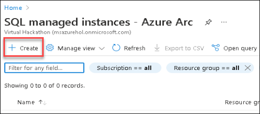
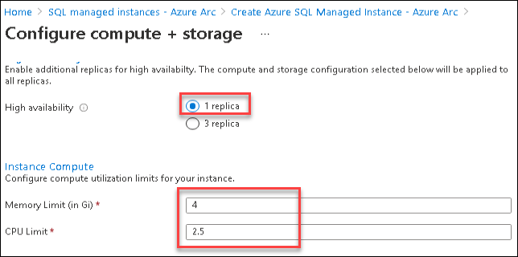
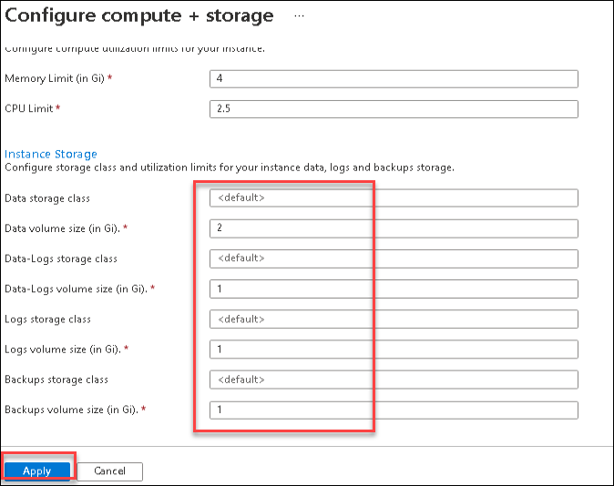
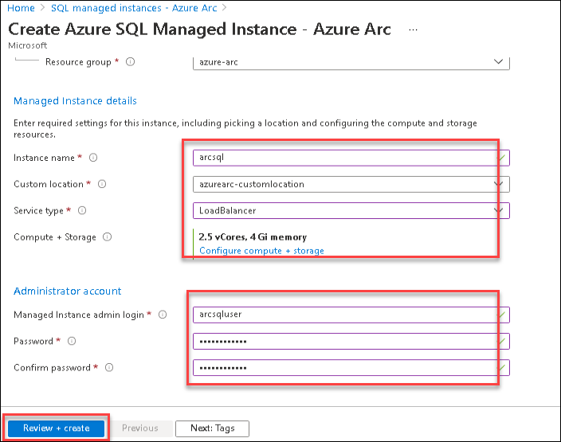
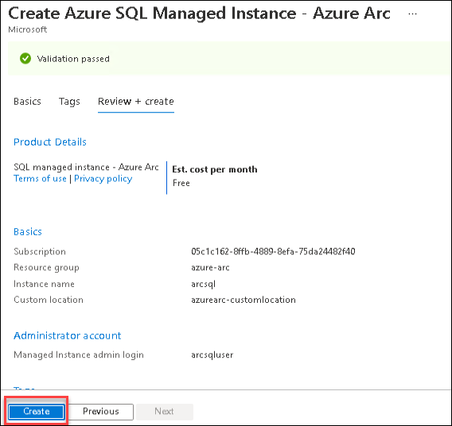
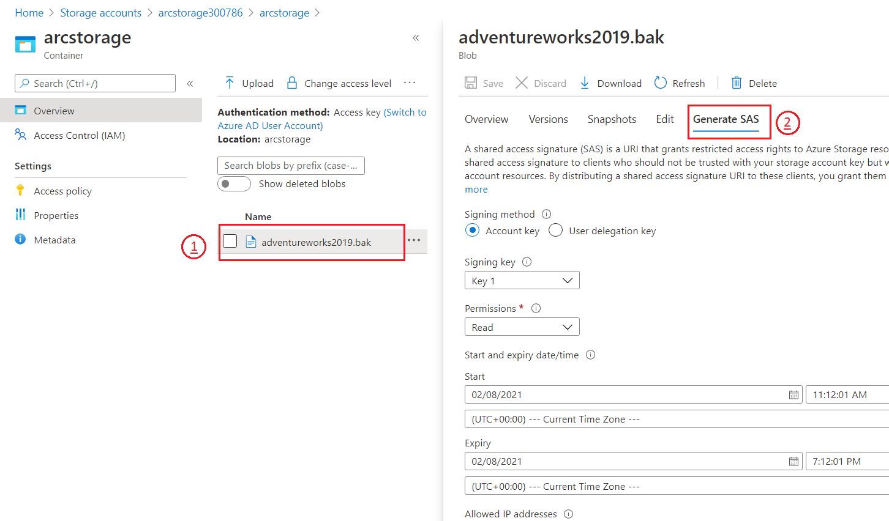
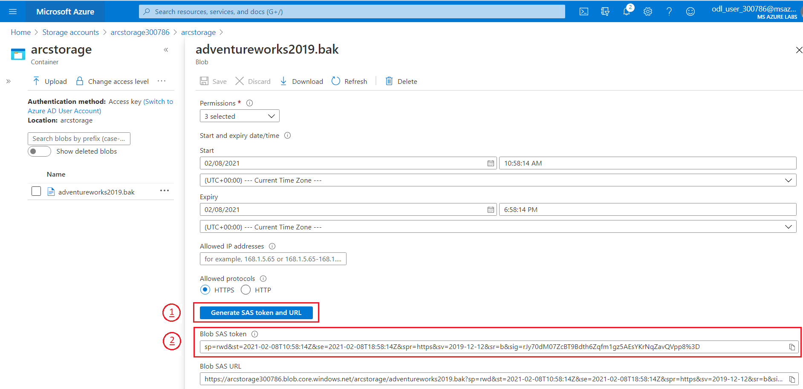
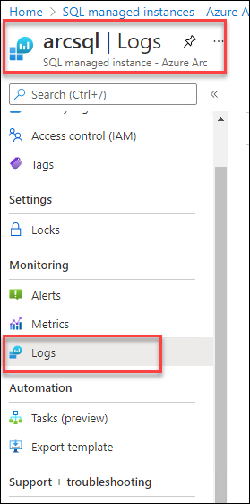
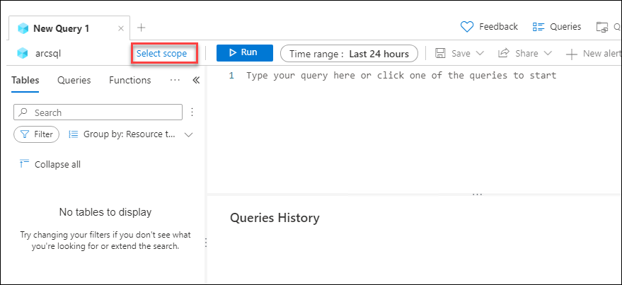
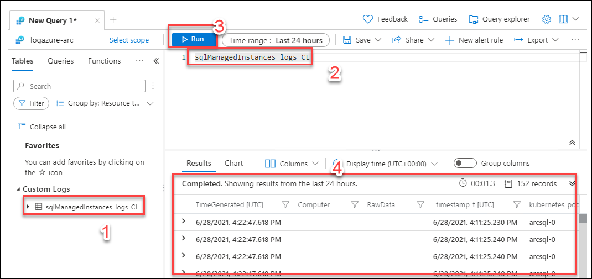

# Exercise 2: Deploy Azure Arc-enabled SQL Managed Instance with Direct Connected Mode.
  Duration: 40 Minutes
  
 In this exercise, let's create an **SQL Managed Instance - Azure Arc** using Azure Portal on top of a directly connect Azure Arc Data controller.

 Also, we will be exploring the Kibana and Grafana Dashboards and upload the logs and metrics to the Azure portal and view the logs.
 
 
 Task 1. Deploy Azure Arc SQL Managed instance.
 
 1. Open your browser and login to Azure portal if not already done.

1. Now Search for SQL Managed Instance -  Azure Arc and select it.

   
   
1. Click on create ** + Create ** button to create the SQL Managed instance - Azure Arc.

   
 
1. Now on **Basics** tab enter the below details:
 
 
   **Under project details**
    
    **Subscription**: Leave ```default```.
    
    **Resource Group**: Select ```azure-arc``` from drop down
    
     
   
   **Under Managed Instance details**
   
    **Instance name**: Enter ```arcsql```
  
    **Custom location**: Select available custom location from dropdown.
   
    **Service type**: Select ```**Load balancer**``` from drop down
    
    **Compute+ Storage**: Click on **Configure compute + storage**
      
      
      
      
    Now on **Compute+ Storage** blade enter the following details:
    
     * High availability : Select ```1``` replica
     * Memory Limit(in Gi): Enter ```4```
     * CPU Limit: Enter ```2```
     * Data storage class: leave default
     * data volume size (in Gi): ```2```
     * Data-logs storage class: leave ```default```
     * Data-logs volume size(in Gi): ```1```
     * Logs storage class: Leave ```deault```
     * Logs storage class: Enter ```1```
     * Backup Storage class: leave ```default```
     * Backups volume size (in Gi): ```1```
    
      
      
      
    
    After adding all the above details click on **Apply** button.
    
     * **Under Administrator account** Enter the below details
    
     * **Managed Instance admin login**:  Enter ```arcsqluser```
   
     * **Password**: Enter ```Password.1!!```
     
     * **Confirm Password**: Enter ```Password.1!!```
  
1. After adding all the required details click on **Review + Create button** to review the all details.
    
    
    
1. Now Click on **Create** button to start the deployment.  
 
    
 
1. After some time you see that the deployment of **SQL Managed Instance - Azure Arc** in completed. Now click on Go to resource button to navigate to the resource.

## validate the **Azure SQL Managed Instance - Azure Arc** is deployed.
 
1. Run the following command in powershell and check if the state is ready or not.
 
    ```
     azdata arc sql mi list
    ```
  
    
  
   > Note: If the state is showing creating then please run the above command after some time and check if the state is changed to ready or not.This can take upto few minutes to change the state to ready.

## Task 2: Connect to Azure Arc enabled Azure SQL Managed Instance using Azure Data Studio.

In this task, let us learn how to connect to your newly created Azure Arc enabled Azure SQL Managed instance using Azure Data Studio.

1. In the **Azure Arc Data Controller dashboard**, under Azure Arc Resources right-click on your newly created Azure SQL Managed instance and select manage, this will open  **SQL Managed instance - Azure Arc Dashboard**.

1. Now in the **SQL Managed instance - Azure Arc Dashboard**, copy the **IP Address** given under external endpoint. You can also see that the status is **Ready**.

   

1. In the Azure Data Studio, in connections tab, within the servers click on **Add Connection**.

   

1. Enter the following in the connection details page and click on **Connect**.

   - **Connection type** : Select **Microsoft SQL Server**.
   
   - **Sever**: Paste the external endpoint value of SQL Managed Instance which you copied earlier

   >**Note**: Make sure you have entered **IP Address** only and remove **port number**.
   
   - **Authentication type** : Select **SQL Login** from the drop down options
   
   - **User name** : Enter arcsqluser
     ```BASH
     arcsqluser
     ```
   
   - **Password** : Enter Password.1!!
     ```BASH
     Password.1!!
     ```
   
     
   
1. Now you can see that you are successfully connected with your Azure Arc enabled SQL MI Server. Under servers you can see that you are successfully connected with your Azure Arc enabled SQL MI Server. You can explore the SQL Managed Instance - Azue Arc Dashboard to view the databases and run a query.

   

## Task 3: Configure Azure Arc enabled Azure SQL Managed Instance

In this task, you will learn to update the configuration of Azure Arc enabled SQL Managed instances with Azure Data CLI.

1. If the **Command Prompt** window is already not opened, open a new one by clicking on Command Prompt icon from the desktop shortcut and run the following command to see configuration options of Azure SQL Managed instance.

   ```BASH
   azdata arc sql mi edit --help
   ```

   

1. Now run the following command to set the custom CPU core and memory requests and limit. 

   >**Note**: The Azure SQL Managed instance name will be **arcsql** if you also provided the same for Instance name during creation of Azure SQL Managed Instance. The name is provided as value at the end of the command Also, you shouldn't select the Core and memory limit more than the given limits.

   ```BASH
   azdata arc sql mi edit --cores-limit 3 --cores-request 2 --memory-limit 2Gi --memory-request 2Gi -n arcsql
   ```      

   

1. Now, you can run the below command to view the changes that you made to the Azure SQL Managed instance.

   >**Note**: The Azure SQL Managed instance name will be **arcsql** if you also provided the same for Instance name during creation of Azure SQL Managed Instance which is already added in the below command.
   
   ```BASH
   azdata arc sql mi show -n arcsql
   ```

   

## Task 4: Restore the AdventureWorks sample database into Azure SQL Managed instance - Azure Arc Using Kubectl.

Migrating an existing SQL database from a SQL Server to Azure Arc enabled SQL MI is very simple. All you have to do is to take a backup from your existing SQL Server, and then restore that backup to SQL MI.

Now let's restore the sample backup file i.e AdventureWorks backup (.bak) into your Azure SQL Managed instance container using Kubectl commands.

1. Launch a **Command Prompt** window from the desktop of your JumpVM if you have already closed the existing one.

1. In the Command Prompt, run the following command to get the list of pods that are running on your data controller. 

   > **Note**: The namespace name for your data controller will be **arcdc**.

   ```BASH
   kubectl get pods -n arcdc
   ```
   
1. From the output of the above command, copy the pod name of the SQL MI instance from the output which will be in following format sqlinstancename-0. If you followed the same naming convention as in the instructions, the pod name will be **arcsql-0**.

   > **Note**: Please copy the Pod Name for the next step.

   
   
1. In the Command Prompt, run the following command after replacing the required values. This will remotely execute a command in the Azure SQL Managed instance container to download the .bak file onto the container.

   >**Note**: The value of the namespace name and pod name is already updated in the below command. Please confirm if the pod name that copied matches the one given below: arcsql-0. 

   ```BASH
   kubectl exec arcsql-0 -n arcdc -c arc-sqlmi -- wget https://github.com/Microsoft/sql-server-samples/releases/download/adventureworks/AdventureWorks2019.bak -O /var/opt/mssql/data/AdventureWorks2019.bak
   ```

   > ```Info:``` arc-sqlmi in the above command is the name of the container within the SQL Managed Instance Pod arcsql-0   

   

1. Now, to restore the AdventureWorks database, you can run the following command.

   > **Note**: All values including the pod and the namespace name have already been added. You can go through the command and figure out what all are being passed as arguements.

   ```BASH
   kubectl exec arcsql-0 -n arcdc -c arc-sqlmi -- /opt/mssql-tools/bin/sqlcmd -S localhost -U arcsqluser -P Password.1!! -Q "RESTORE DATABASE AdventureWorks2019 FROM  DISK = N'/var/opt/mssql/data/AdventureWorks2019.bak' WITH MOVE 'AdventureWorks2017' TO '/var/opt/mssql/data/AdventureWorks2019.mdf', MOVE 'AdventureWorks2017_Log' TO '/var/opt/mssql/data/AdventureWorks2019_Log.ldf'"
   ```

   

1. Now you can switch back to Azure Data Studio.

1. Then, right-click on the SQL Managed Instance Server under CONNECTIONS tab on the top left of the Azure Data Studio

1. And, then click on refresh.

1. Now, expand your SQL Managed Instance server if not already by clicking on the arrow icon on the left of the IP Address, then expand Databases and verify that AdventureWorks2019 Database is listed there.

   

## Task 5: Migrate and Restore SQL Server DB to Azure Arc enabled Azure SQL Managed instance from Blob storage and Azure arc pod.

Now that we have the Azure SQL Managed instance ready, let's migrate and restore the SQL server database to the Azure arc enabled SQLMI. 
   
There are two methods to do the migration and restore - One is by using the Azure blob storage to back up and restore DB to SQLMI, and the Second one is by using the kubectl commands. 

 **Method 1: Using Azure blob storage** 
 
 **Step 1: Migrate: SQL Server to Azure Arc enabled Azure SQL Managed instance**

1. Navigate to Azure Portal Home - https://portal.azure.com/home and login if you haven't already.

1. From the home page, select Resource groups from under Navigate or Azure services.

    

1. From the list of resource groups in the next page, click on the **azure-arc** resource group. 

1. From the next page, you will be able to find a resource of type Azure blob storage with name as **arcstorage<inject key="DeploymentID/Suffix" />**. Click on that resource. 

    

1. You will be directed to the overview blade of the resource. Then, scroll down the menu on the left side bar and click on the **Shared access signature**. Now click on the **Generate SAS and connection string** button to get the keys.

   > **Note**: Before generating SAS token make sure all the three check boxes(Service, Container, Object) under **Allow resource types** are checked. Also, you can update the expiry Date/Time to match your requirement

    
   
   > **Info**: **Shared Access Signature** makes sure that the database backups are only available for authorized users. 

    

1. Now you will be able to see the storage account name at the top and Shared access signature token. Copy the Storage account name and SAS token from the portal and save it in a **notepad** for later usage. Then, click on Overview from the left tab and then select **Containers** and copy the container name onto the notepad for later use.

    

   > **Note**: After copying SAS token to notepad remove **?** at the beginning of the token before using it later.

    

1. In Azure Data Studio, to connect the Source SQL Server, Click on the **New Connection** Button to add the details. 

    

1. Provide the following details in the blade that comes up:
   
   - Select Connection type as **Microsoft SQL Server**
   - **Server**: **localhost**

      ```
      localhost
      ```

   - **Authentication type**: **Windows Authentication**
     
1. Click on **Connect** button after entering the above values.
   
    
   
1. After connecting, **expand** the localhost server from within the server tab on the left and click on the databases folder and right-click on **AdventureWorks2019** Database, and select **New Query**.

    

1. Copy the query into the Azure Data Studio **Query Editor** window and prepare your query by replacing the placeholders indicated by the <...> using the **Storage account name** and **SAS token** in earlier steps. 

   Once you have replaced the values, run the query by clicking on **Run button**. 

   ```BASH
   CREATE CREDENTIAL [https://<storage-account-name>.blob.core.windows.net/arcstorage] WITH IDENTITY = 'Shared Access Signature' 
   ,SECRET = '< replace with sas token >'
   ```

   Once you verify that the Command is executed successfully go to the next step.
          
    

1. Similarly, prepare the BACKUP DATABASE command by copying the below query and replacing the existing query in the Query Editor to backup the database to the blob container. 

   Make sure you replace the value of **Storage account name**. Once you have replaced the values, you can run the query. 

   ``` 
   BACKUP DATABASE AdventureWorks2019 TO URL = 'https://<storage-account-name>.blob.core.windows.net/arcstorage/AdventureWorks2019.bak'; 
   ```

   Once you see that the command is executed successfully, you can go to the next step.

    
   
1. Navigate to Azure portal and validate that the backup file created in the previous step is visible in the Blob container. For this, you have to go to the storage account and click on the **container** button and then open the **arcstorage** to view the backup file.
  
    

**Step 2: Restore the database from Azure blob storage to Azure SQL Managed instance - Azure Arc**

1. Navigate back to Azure Data Studio, login and connect to the Azure SQL Managed instance - Azure Arc if not already .

1. Expand the System Databases under Azure SQL Managed Instance connection.

1. Then, right-click on the **master** database, and select **New Query**.

    

1. In the query editor window, prepare and run the below query by replacing with the required values to create the credentials.

   ```
   CREATE CREDENTIAL [https://<storage-account-name>.blob.core.windows.net/arcstorage] WITH IDENTITY = 'Shared Access Signature' 
   ,SECRET = '< SAS >'
   ```
 
1. Prepare and run the below command to verify the backup file is readable and intact. Make a note of logical names from the output windows.

   ```
   RESTORE FILELISTONLY FROM URL = 'https://<storage-account-name>.blob.core.windows.net/arcstorage/AdventureWorks2019.bak'

   ```

1. Prepare and run the RESTORE DATABASE query as follows to restore the backup file to a database on Azure SQL Managed instance - Azure Arc. Make sure to replace the **storage account name** in the below query before running it. 

   ```
   RESTORE DATABASE AdventureWorks2019 FROM URL = 'https://<storage-account-name>.blob.core.windows.net/arcstorage/AdventureWorks2019.bak'
   WITH MOVE 'AdventureWorks2017' to '/var/opt/mssql/data/AdventureWorks2019.mdf'
   ,MOVE 'AdventureWorks2017_log' to '/var/opt/mssql/data/AdventureWorks2019.ldf'
   ,RECOVERY  
   ,REPLACE  
   ,STATS = 5;  
   GO
   ```
   
    
    
**Method 2: Copy the backup file into an Azure SQL Managed instance - Azure Arc pod using kubectl**
   
This method shows you how to take a backup file that you create via any method and then copy it into local storage in the Azure SQL Managed instance pod.
   
So you can restore from there much like you would on a typical file system on Windows or Linux.
   
In this scenario, you will be using the command kubectl cp to copy the file from one place into the pod's file system.
   
1. Connect to the **localhost** SQL Server using Azure Data Studio and right-click on the **master** database and then, click on the **new query** and paste the below query.
   > **Note**: Make sure that you are running this query in **localhost** database.
   
   ```
   BACKUP DATABASE AdventureWorks2019
   TO DISK = 'c:\tmp\adventureworks2019.bak'
   WITH FORMAT, MEDIANAME = 'AdventureWorks2019' ;
   GO
   ```
    
2. Navigate to **Command Prompt** Window you have already opened and run the below command to get the **SQLMI pod name**.
   
   ```
   kubectl get pods -n arcdc
   ```

3. Copy the backup file from the **local** storage to the **SQL pod** in the cluster using the below SQL query. Make sure you **replace** the SQLMI pod name and DB name.
   
   ```
   kubectl cp /tmp/AdventureWorks2019.bak arcsql-0:var/opt/mssql/data/adventureworks2019.bak -c arc-sqlmi -n arcdc
   ```

   > ```Note:``` We have already replaced the value of container and pod in the above command. 

4. Now, switch back to **Azure data studio** and open a **new query** in SQLMI instance and run the below query to restore the database to the Azure SQL Managed instance - Azure arc
     
   ```
   RESTORE DATABASE AdventureWorks2019 FROM DISK = '/var/opt/mssql/data/adventureworks2019.bak'
   WITH MOVE 'AdventureWorks2017' to '/var/opt/mssql/data/adventureworks2019.mdf'  
   ,MOVE 'AdventureWorks2017_log' to '/var/opt/mssql/data/adventureworks2019.ldf'  
   ,RECOVERY  
   ,REPLACE  
   ,STATS = 5;  
   GO
   ```

5. Now you have seen how the database can be restored in different ways.   
## Task 6: View SQL Mi logs in Azure portal.
   
Now that we have the database created, let us view some metrics, usages, and logs in the Azure portal.
   
1. Switch back to azure portal and navigate to your Azure arc enabled SQLMI.

1. Now select the logs from Left side menu.

    

1. if you see any queries window, click on the close button from right corner.

    
     
1. Now click on **Select scope** button to select the log analytics workspace that is connect with Azure Arc data controller to get the logs.

    
    
1. Select your log analytics workspace with the name of **logazure-arc** and click on **Apply** button to select the scope.
    
    
   
1. In the logs page, expand Custom Logs at the bottom of the list of tables and you will see a table called **sqlManagedInstances#####**.
   
    

1. Double click on the table name to generate the query in query editor and click on Run button to execute the query to get the logs.
   
    


## Task 7: Monitor with Azure Data Studio

Now let us Monitor the SQL MI status using Grafana and Kibana.
  
1. Open Azure Data studio on the JumpVM provided and right-click on the SQL MI resource under the Azure Arc controller and click on manage.
  
1. Now copy the endpoint for Kibana dashboard and browser this endpoint in a browser.
  
1. Enter below user name and password for SQLMI.
  
   > **Note** You have to enter the credentials of Azure Arc data controller.
  
   - **User name** : arcuser
     ```BASH
     arcuser
     ```

   - **Password** : Password.1!!
     ```BASH
     Password.1!!
     ```

    
   
    

1. You can explore the page for kibana. 
  
   > ***Info***: You can learn more about kibana here: [View logs and metrics using Kibana and Grafana](https://docs.microsoft.com/en-us/azure/azure-arc/data/monitor-grafana-kibana)
    
## View the Visualization and metric using grafana graph
  
1. Now go back to the Azure Data Studio which you had opened earlier on the provided JumpVM on the left.
  
1. Now copy the endpoint for the Grafana dashboard and browser this endpoint in a browser.
  
1. Enter below user name and password for SQLMI.
  
   > **Note** You have to enter the credentials of the Azure Arc data controller.
      
   - **User name** : arcuser
     ```BASH
     arcuser
     ```

   - **Password** : Password.1!!
     ```BASH
     Password.1!!
     ```

    
   
1. You can explore the page for Grafana. 
  
   > ***Info***:  You can learn more about Grafana here: [View logs and metrics using Kibana and Grafana](https://docs.microsoft.com/en-us/azure/azure-arc/data/monitor-grafana-kibana)  
  

## After this exercise, you have performed the following

   - Created Azure SQL Managed instance.
   - Connected to Azure Arc enabled Azure SQL Managed instance.
   - Configured Azure Arc enabled SQL Managed Instance.
   - Restored the AdventureWorks sample database into Azure SQL Managed instance - Azure Arc.
   - Migrated and Restored SQL Server DB to Azure Arc enabled Azure SQL Managed instance from Blob storage and Azure arc pod.
   - Viewed SQL MI resources and logs in Azure portal.
   - Monitored with kibana and grafana.
