## Exercise 3: Deploy Azure Database for PostgreSQL server groups - Azure Arc using Azure portal
   Duration: 40 Minutes

In this exercise you will be deployming Azure Database for PostgreSQL server groups - Azure Arc on top of a direct mode of Azure Arc data controller.
Now that you are familiar with the existing Kubernetes cluster and Data controller, let's perform the following in this exercise:

## Create a Postgres Hyperscale Server group using Azure portal
 * Configure & Scale, Connect source database
 * Backup & Restore on Postgres DB
 * Monitor/Visualize with Grafana & Kibana Dashboards

## Task 1: Create Azure Database for PostgreSQL server groups - Azure Arc

1. Open you browser and navigate to portal.azure.com and login with you alb credentials if not already done.

1. Click on the search box and search for postgrs and select **Azure Database for PostgreSQL server groups - Azure Arc** from the list.

    
   
1. After selecting the **Azure Database for PostgreSQL server groups - Azure Arc** from the list click on **Create** button.

    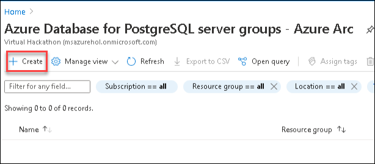
    
1. Now on **Basic** blade of **Azure Database for PostgreSQL server groups - Azure Arc** enter the below details in the required fields:
    * Subscription: Leave default
    * Resource Group: Select azure-arc from the drop down list
    **Under Managed Instance details**   
       * **Instance name**: Enter arcpostgres
       * **Custom location**: Select available custom location from dropdown.
       * **Service type**: Select **Load balancer** from drop down    
       * **Compute+ Storage**: Click on **Configure compute + storage**      
    
      Now on **Compute+ Storage** blade enter the following details:
       * Number of worker nodes : Enter 2
       * Data storage class: leave default
       * data volume size (in Gi): 1
       * Data-logs storage class: leave default
       * Data-logs volume size(in Gi): 1
       * Logs storage class: Leave deault
       * Logs storage class: Enter 1
       * Backup Storage class: leave default
       * Backups volume size (in Gi): 1

      
     
      * CPU Request: ```1```
      * CPU limit: ```2```
      * Memory request (in GiB): ```2```
      * Memory limit (in GiB): ```2```

      Now click on apply to save these values.
  
     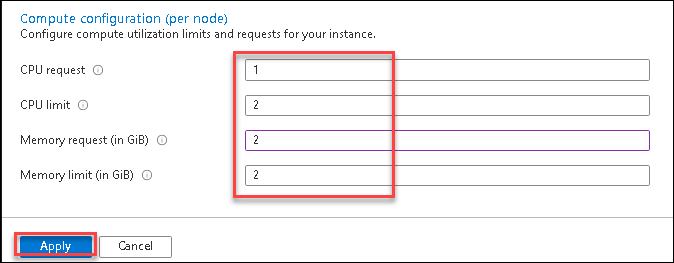
   
      * Extension: Leave default(citus)
  
     Under administrator account.
      * Password: ```Password.1!!```
      * Confirm Password : ```Password.1!!```

1. After adding all the details click on **Review + Create** button to validate all the added details.
 
    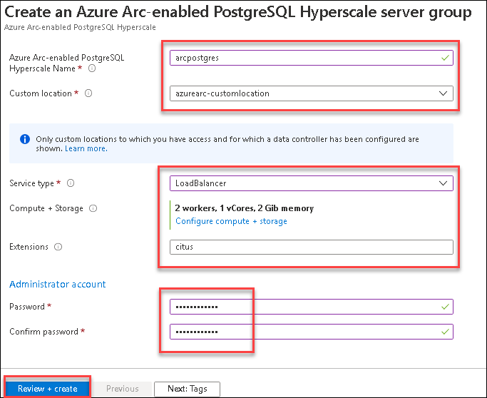

1. Now Click on **Create** button to start the deployment. Note that the deployment can take up to few minutes.
 
    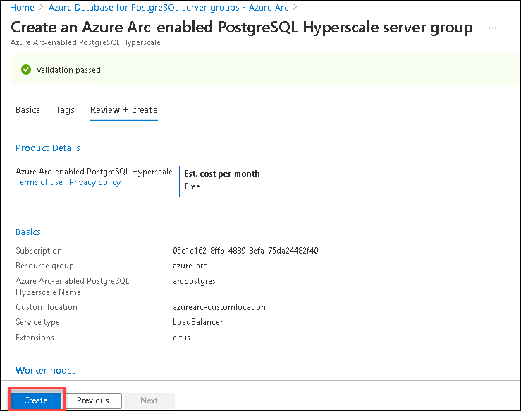
   
1. Once the deployment got completed you will see the **Go to resource** button, click on that button and navigate to the newly created Azure Database for PostgreSQL server groups - Azure Arc.

1. On the overview page of Azure Database for PostgreSQL server groups - Azure Arc using Azure portal, you can see all the detials and configirations.

    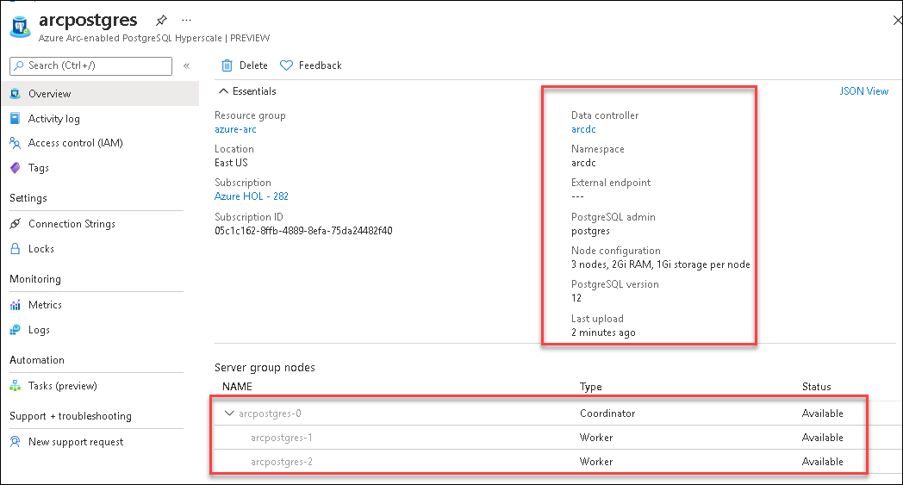
 
  > **Note:** Please note that the **External endpoint** can take upto 5 mintues to reflect on Azure portal.

# Validate the deployment of Azure Arc enabled PostgreSQL.
  
1. Open the command prompt window and run the following to get the Postgres servers list in AKS using the Azure Arc data controller. You will see the output as mentioned in the screenshot below.
   
   ```BASH
   azdata arc postgres server list
   ```
   
   
1. Once the status of postgre SQL is changed to ready, Switch back to azure portal and on overview blade of Azure Arc enabled PostgreSQL serveryou will see that  **External endpint** is available on azure portal now, Please copy the endpoint and save it in a nptepad for later use.


**Connect source database and Azure Arc enabled PostgreSQL server**

1. Open the **command prompt** window and run the following to get the Postgres servers list in AKS using the Azure Arc data controller. You will see the output as mentioned in the screenshot below.
   
   ```BASH
   azdata arc postgres server list
   ```
  
   

1. On your LabVM, open the **PgAdmin** tool from desktop to connect to the Azure arc enabled Postgres Hyperscale database.

      

   > **Note**: If you get any prompts to unlock master password, please provide `Password.!!1`, select **Save Password** and then click on **OK**.
   ```BASH
   Password.!!1
   ```

1. Now, right-click on the Servers and click on **Create**. Then, click on **Server**.

   
   
1. Now provide the following details:

   - Name: postgres01
     ```BASH
     postgres01
     ```
   
   

1. Run the following command in command prompt window to get connection string details for **postgres01** server endpoint.

   ```BASH
   azdata arc postgres endpoint list -n arcpostgres
   ```
   

1. Now, select the connection tab and enter the connection string details by getting the values from the output of the previous azdata endpoint list command. You will see the following line in the previous output. Fetch the **IP Address** from the endpoint URL and add it in the **connection string details**.

   ```BASH
   PostgreSQL Instance   postgresql://postgres:<replace with password>@40.121.8.176:5432
   ```

   - Host name/address: Provide the copied IP Address
   - Port: 5432
   - Username: postgres
   - Password: 
     ```
     Password.!!1
     ```
   - Tick "Save Password?" field

   

1. After you click on **Save**, you will be connected to the server.

   

## Task 2: How to migrate from different servers?

Now, let's migrate a PostgreSQL database to Azure Arc enabled PostgreSQL Hyperscale server group. The following steps are applicable to PostgreSQL database running on any cloud server or on-premises.

#### **Backup from Source Server:**

Let's take a backup of the Postgres Server running on a server named **PostgreLocal**. It contains a database named **Arc-Demo-PG** which has 4 tables.

#### Take a backup of the source database in on-premises

1. In the pgAdmin, click on the arrow icon next to **PostgreLocal** Server to expand the menu. If you get any prompts for password, please provide "Password.!!1"
  
   ```BASH
   Password.!!1
   ```

    
   
1. You will get below screen after entring the password.

      
   
1. Then right-click on the **Arc-Demo-PG** and select **Backup...** option

   

1. Then provide the following details: 

   - Filename: **C:\Users\arcadmin\Arc-Demo-Bkp**
     ```BASH
     C:\Users\arcadmin\Arc-Demo-Bkp
     ```
        
   - Format: **Custom**
     ```BASH
     Custom
     ```
     
   

1. You can keep rest of the values as default and then click on **Backup**.

1. Now, the backup job will get started and will get completed successfully in a few seconds.

   
   
1. Close the backup prompt by clicking on the close icon (x) in the prompt.

#### **Restore to Destination Server**:

Now let's restore the sample database **Arc-Demo-Bkp** from source server **PostgresLocal** on to the Postgres server **postgres01** running on an Azure Arc environment with a new Database named **Restored_Arc-Demo-Bkp**. 

First, let's create an empty database on the destination system in your Azure Arc enabled PostgreSQL Hyperscale server group

1. Right-click on the **postgres01** server on the pgAdmin and then Select **Create -> Database** option from postgres01 database menu

   

1. In the create window that comes up, provide the Database name as **Restored_Arc-Demo-PG** and then click on the **Save** button at the bottom of the blade.

   

   Now, you will restore the database into your Arc enabled data services environment:

1. Expand the postres01 server by clicking on the " > " icon next to postgres01.

1. Right-click on the **Restored_Arc-Demo-PG** database and then click on the **Restore** option.

1. In the restore window that comes up, provide the following path for the Filename: **C:\Users\arcadmin\Arc-Demo-Bkp**
   ```BASH
   C:\Users\arcadmin\Arc-Demo-Bkp
   ``` 

1. Keep the default values for the rest of the options and then click on **Restore**.
   
   
   
1. Now, a restore job will be created which will take around 1 second to complete successfully. 
      
   
   
1. Once the restoration is successful, you can close the prompt by clicking on x icon at the top right of the prompt.

#### **Verification of the restored database on Azure Arc enabled PostgreSQL Hyperscale server group**:

Now, we are done with the backup and restoration, let's verify if the database has been restored from the database running on the source server to the Arc enabled PostgreSQL Server by querying the data in both databases.

   Now, use PgAdmin in which you are already connected to both Postgres instances ( local and Arc ).

1. First, you will connect to the database **Arc-Demo-PG** in **PostgreLocal** server and query the row count in table pgbench_accounts:

1. Right-click on the database **Arc-Demo-PG**  and select Query tool to open a new query window 

   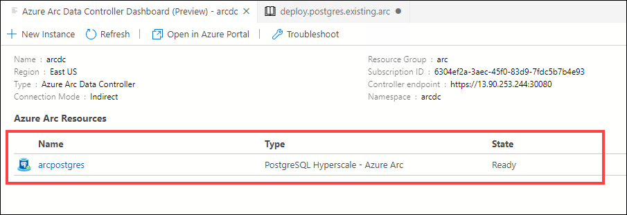

1. Copy and paste the below query in the Query Editor 

   ```BASH
   select count(*) from Public.pgbench_accounts;
   ```
   
1. Click on > icon on the top right to run the query to see the no of rows of **pgbench_accounts** table 

   
   
    > You'll see that the no of rows of data is 10000.
    
1. Now since we have count from the local database, let's see the output for the same query in the new database we created. Connect to the database **Restored_Arc-Demo-PG** and query the row count in table pgbench_accounts:

1. Right-click on the database **Restored_Arc-Demo-PG**  and select Query tool to open a new query window 

1. Copy and paste the below query in the Query Editor 

   ```BASH
   select count(*) from Public.pgbench_accounts;
   ```
   
1. Click on > icon on the top right to run the query to see the no of rows of **pgbench_accounts** table 

   
   
The database migration was successful if the row counts are the same in both **Arc-Demo-PG** and **Restored_Arc-Demo-PG** Databases.

## Task 3: Distribution(Shard) of data on worker nodes in Azure Arc PostgreSQL – Hyperscale 

In this task, let us work on the Distribution (Shard) of data on worker nodes.

   > ***Info***: Distributing table rows across multiple PostgreSQL servers is a key technique for scalable queries in Hyperscale (Citus). Together, multiple nodes can hold more data than a traditional database, and in many cases can use worker CPUs in parallel to execute queries. To know more about **Shard data on PostgreSQL – Hyperscale**, you can check : [Shard data on PostgreSQL – Hyperscale](https://docs.microsoft.com/en-us/azure/postgresql/tutorial-hyperscale-shard#data-skew)

First, open the query tool by right-clicking on **postgres** database in **postgres01** server and select the **Query Tool...** option.


In the previous tasks, we had created a Postgres Hyperscale server group with two worker nodes.

1. First run the following query to check the active workers in the **pg_dist_node table**.

   ```BASH
   select nodeid from pg_dist_node where isactive;
   ```

   You will get a similar result

   

### Distribution of table data throughout the Hyperscale server group.
1. You have to distribute table data throughout the Hyperscale server group. 
   
   > ***Info***: Distributing a table assigns each row to a logical group called a shard. 
   
   Run following queries to create a table and distribute it

   ```BASH
   create table users ( email text primary key, bday date not null );
   ```

   

   ```BASH
   select create_distributed_table('users', 'email');
   ```

   

   Hyperscale assigns each row to a shard. Every row will be in exactly one shard, and every shard can contain multiple rows.

1. By default ***create_distributed_table()*** makes 32 shards, as you can see by counting in the metadata table **pg_dist_shard**

    Run following query to check the counting in the metadata table **pg_dist_shard**
    ```BASH
    select logicalrelid, count(shardid) from pg_dist_shard group by logicalrelid;
    ```

    
   

1. Run Following query to create sample data for **users** table

   ```BASH
   insert into users
   select
      md5(random()::text) || '@test.com',
      date_trunc('day', now() - random()*'100 years'::interval)
   from generate_series(1, 1000);
   ```

   

### View distributed data by Querying distributed tables

In the previous sections, you have seen how distributed table rows are placed in shards on worker nodes. Now let's see the distributed data present in the **users** table.

1. You can look at the shard placements in *pg_dist_placement*. Joining it with the other metadata tables you can see where each shard is placed.

   ```BASH
   select
    shard.logicalrelid as table,
    placement.shardid as shard,
    node.nodename as host
   from
    pg_dist_placement placement,
    pg_dist_node node,
    pg_dist_shard shard
   where placement.groupid = node.groupid
     and shard.shardid = placement.shardid
   order by shard
   limit 5;
   ```
   
   
   
   > **Note**: In the above result you can see distribution of shards into different worker nodes under *host text* coloumn which shows DNS names or IP address of worker nodes.

1. Run the following query to find the average age of users, treating the distributed **users** table like it's a normal table

   ```BASH
   select avg(current_date - bday) as avg_days_old from users;
   ```

   

   The output shows an example of a Distribution (sharding) of data across worker nodes.

## Task 4: Backup/Restore and Review the distribution of data 

In this task, let's see how to backup the database in Arc enabled PostgreSQL Servers and restore it.

1. To get started, open the **Command Prompt** window.

1. Now, let's verify if the Hyperscale server group has been configured to use a backup storage class.

1. Run the following command to view details of the existing PostgreSQL Hyperscale server

   ```BASH
   azdata arc postgres server show -n arcpostgres
   ```
   Scroll and look at the storage section of the output and confirm backup storage class is there:
   
   
   
### Take a manual full backup

1. Run the following command to take a full backup of the entire data and log folders of the Postgres server group by :
   ```BASH
   azdata arc postgres backup create --name backup01 --server-name arcpostgres
   ```
   This command will coordinate a distributed full backup across all the nodes that constitute Azure Arc enabled PostgreSQL Hyperscale server group.

   Where:
   - **name** indicates the name of a backup
   - **server-name** indicates a server group

   When the backup completes, the ID, name, size, state, and timestamp of the backup will be returned as showed in the image below.

   

   In the above result, "+00:00" means UTC time (UTC + 00 hour 00 minutes)

### List backups

1. Now let's list the backups that are available to restore.
   ```BASH
   azdata arc postgres backup list --server-name arcpostgres
   ```
   Returns an output as mentioned in the image below:

   

### Restore a full backup

1. After confirming that the backup was successful, let's restore the backup of server group postgres onto itself.

   Run following command to restore **postgres** DB onto itself. Get the backup-id from the output of the last command.
   ```BASH
   azdata arc postgres backup restore -sn arcpostgres --backup-id <backup-id>
   ```

   Note that this operation is only supported for PostgreSQL version 12 and higher.

### Reviewing Distribution of data 

> **Note**: Distributing a table assigns each row to a logical group called a shard. Here only the table and it's rows are distributed to different shards. So, the resulted output data will remain same even after distributing the table rows. 

1. Now, go back to the **pgAdmin** portal in Edge Browser. In distributed table by default create_distributed_table() makes 32 shards, as you can see by counting in the metadata table **pg_dist_shard**

   Run following query against postgres database in **postgres01** server to check the count in the metadata table **pg_dist_shard**
   ```BASH
   select logicalrelid, count(shardid) from pg_dist_shard group by logicalrelid;
   ```

   
   
1. You can look at the shard placements in *pg_dist_placement*. Joining it with the other metadata tables you can see where each shard is placed.

    ```BASH
    select
     shard.logicalrelid as table,
     placement.shardid as shard,
     node.nodename as host
    from
     pg_dist_placement placement,
     pg_dist_node node,
     pg_dist_shard shard
    where placement.groupid = node.groupid
      and shard.shardid = placement.shardid
    order by shard
    limit 5;
     ```
   
    
   
    > **Note**: In the above result you can see distribution of shards into different worker nodes under *host text* coloumn. 


1. Run the following query to find the average age of users which gets data from distributed table **users**. 

    ```BASH
    select avg(current_date - bday) as avg_days_old from users;
    ```

    You have executed the above query by treating the distributed **users** table like it's a normal table

   

   The output shows distributed data across worker nodes.

## Task 5: Configure & Scale, and review the distribution of data.

Contoso is happy with the current performance of PostgreSQL Hyperscale but they also anticipate that when they go in production, the database will grow significantly and there will be more users querying the database. Therefore they want to leverage the unique capability of PostgreSQL Hyperscale to scale out with additional worker nodes. They also like the fact that they will be able to add nodes and redistribute the data across the worker nodes as an online operation.

Now let's see how to Configure & Scale, and review the distribution of data on the Database.

1. Launch **Command Prompt** from desktop of the LabVM.

1. Run the following query to verify that you currently have three Hyperscale worker nodes, each corresponding to a Kubernetes pod.

   ```BASH
   azdata arc postgres server list
   ```

   
   
1. Now to scale-out **Azure Arc enabled PostgreSQL Hyperscale**,  in the command prompt run the following command. This will increase the number of worker nodes from 2 to 3.

   ```BASH
   azdata arc postgres server edit -n arcpostgres -w 3
   ```
  
   > **Note**: Command will take few minutes to complete 
  
1. Run the following command and verify that the server group is now using the additional worker nodes you added. In the output, you should be able to see 3 worker nodes.
   
   ```BASH
   azdata arc postgres server list
   ```

   > ***Info***: Once the nodes are available, the **Hyperscale Shard Rebalancer** runs automatically and redistributes the data to the new nodes. The scale-out operation is an online operation. While the nodes are added and the data is redistributed across the nodes, the data remains available for queries.

1. You can also scale up, from **PostgreSQL Hyperscale - Azure Arc Dashboard**. 

### Reviewing Distribution of data 

> **Note**: Distributing a table assigns each row to a logical group called a shard. Here only the table and it's rows are distributed to different shards. So, the resulted output data will remain same even after distributing the table rows. 

1. Now, go back to the **pgAdmin** portal in Edge Browser. In distributed table by default create_distributed_table() makes 32 shards, as you can see by counting in the metadata table **pg_dist_shard**

   Run following query to check the count in the metadata table **pg_dist_shard**
   ```BASH
   select logicalrelid, count(shardid) from pg_dist_shard group by logicalrelid;
   ```

   

1. You can look at the shard placements in *pg_dist_placement*. Joining it with the other metadata tables you can see where each shard is placed.

   ```BASH
   select
    shard.logicalrelid as table,
    placement.shardid as shard,
    node.nodename as host
   from
    pg_dist_placement placement,
    pg_dist_node node,
    pg_dist_shard shard
   where placement.groupid = node.groupid
     and shard.shardid = placement.shardid
   order by shard
   limit 5;
   ```
   
   
   
   > **Note**: In the above result you can see distribution of shards into different worker nodes under *host text* coloumn. 

1. Run the following query to find the average age of users which gets data from distributed table **users**. 

   ```BASH
   select avg(current_date - bday) as avg_days_old from users;
   ```

   You have executed the above query by treating the distributed **users** table like it's a normal table. You will get a similar output as shown below.

   

## Task 6: Monitor/Visualize with Dashboards

Now that you are connected to a data controller, let's view the dashboards for the data controller and any SQL managed instances or PostgreSQL Hyperscale server group resources that you have.

1. Open Azure Data Studio. In the **Connections** panel, under **Arc Controllers** right-click on the  arcdc data controller and select **Manage**. and then click on **arcpostgres** under Azure Arc Resources.

   

1. In the Azure Arc Data Controller dashboard, you can see Grafana and Kibana Dashboard URLs along with details about the data controller resource.

   

   > ***Info***: Kibana and Grafana web dashboards are provided to bring insight and clarity to the Kubernetes namespaces being used by Azure Arc enabled data services. 

1. Now copy the endpoint for Kibana dashboard and paste this endpoint url in a browser. If you get a prompt - connection isn't private, you can click on Advanced and then select Continue to ip address to access the link.

      
  
1. Enter below user name and password for Postgres DB.
  
   > **Note** You have to enter the credentials of the Azure Arc data controller.
  
   - **User name** : arcuser
     ```BASH
     arcuser
     ```

   - **Password** : Password.1!!
     ```BASH
     Password.1!!
     ```
   
   

   You can see all logs under discover tab from left side menu.
  
  > ***Info***: You can learn more about kibana here: https://docs.microsoft.com/en-us/azure/azure-arc/data/monitor-grafana-kibana
 
### View the Visualization and metric using grafana graph
    
1. Now, copy the endpoint for the Grafana dashboard and paste this endpoint url in a browser. If you get a prompt - connection isn't private, you can click on Advanced and then select Continue to ip address to access the link.
  
1. Enter below user name and password for Postgres DB.
  
   - **Note** You have to enter the credentials of the Azure Arc data controller.

   
  
   - **User name** : arcuser
     ```BASH
     arcuser
     ```

   - **Password** : Password.1!!
     ```BASH
     Password.1!!
     ```

   
   
   You can explore the metrics for postgres server on this Grafana page. 
  
    > You can learn more about Grafana here: https://docs.microsoft.com/en-us/azure/azure-arc/data/monitor-grafana-kibana


## Task 7:  View Azure Arc enabled PostgreSQL Hyperscale server groups in Azure portal.

In this task, let's view logs for your Azure Arc enabled PostgreSQL Hyperscale server groups in the Azure portal.
   
1. Switch back to azure portal and navigate to your Azure arc enabled PostgreSQL Hyperscale server group.

1. Now select the logs from Left side menu.

    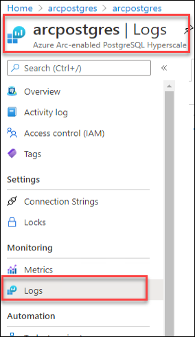

1. if you see any queries window, click on the close button from right corner.

    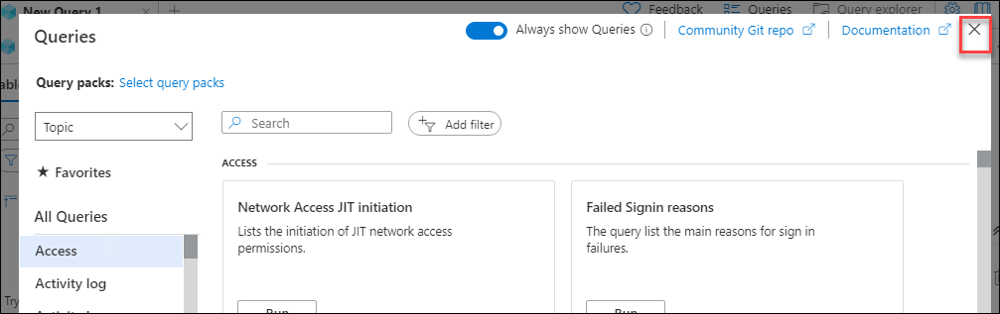
     
1. Now click on **Select scope** button to select the log analytics workspace that is connect with Azure Arc data controller to get the logs.

    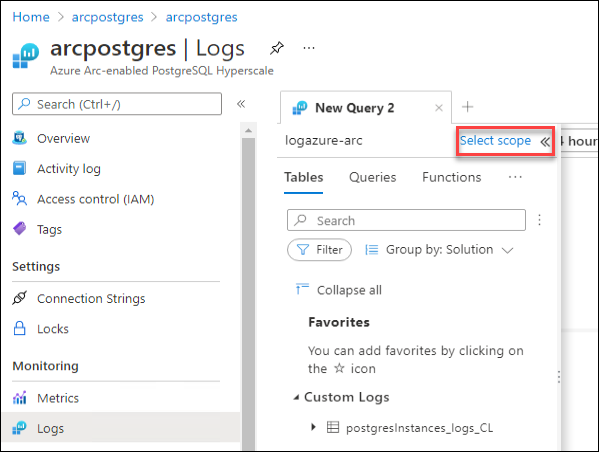
    
1. Select your log analytics workspace with the name of **logazure-arc** and click on **Apply** button to select the scope.
    
    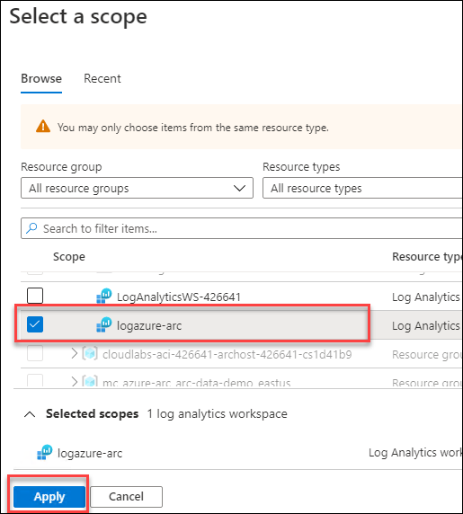
   
1. In the logs page, expand Custom Logs at the bottom of the list of tables and you will see a table called **postgresInstances_logs_CL**..
   
   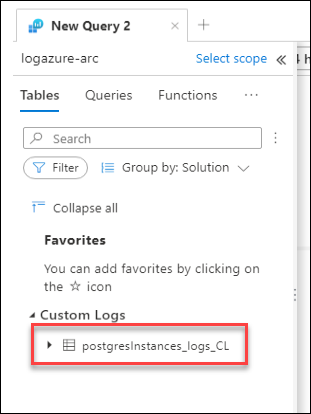

1. Double click on the table name to generate the query in query editor and click on Run button to execute the query to get the logs.
   
   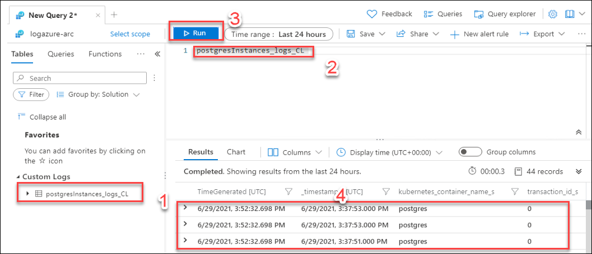

## After this exercise, you have learned the following

   - Create a Postgres Hyperscale Server group using Azure Portal.
   - Backup/Restore and Review the distribution of data.
   - How to migrate from different server.
   - Distribution(Shard) of data on worker nodes.
   - Configure & Scale, and review the distribution of data.
   - Monitor/Visualize with Azure f Studio Dashboards.
   - Upload usage data, metrics, and logs to Azure Monitor.
